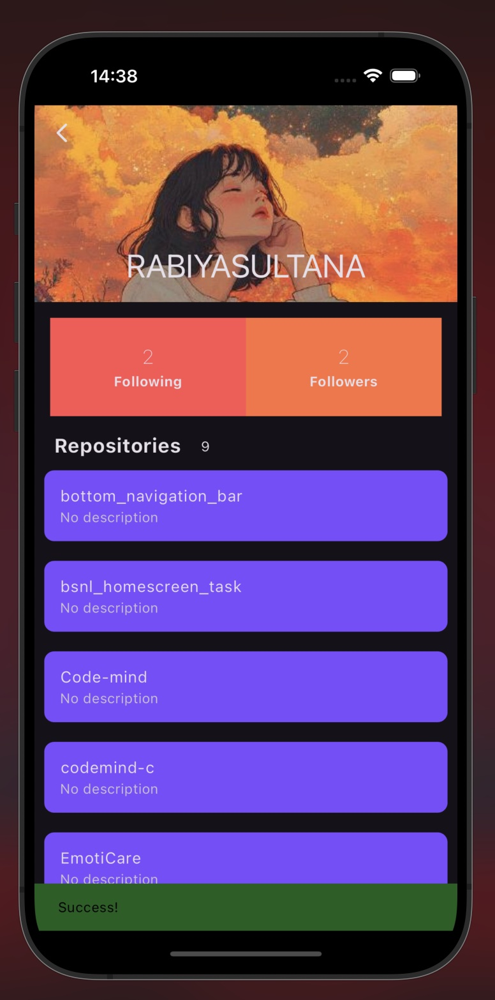

# GitTrack

**A Clean GitHub Profile Viewer**

## Overview

GitTrack is an app that allows users to search for any GitHub user and view detailed information about their profile, repositories, followers, following, and more — all in one place using the GitHub API.

## Features

- **User Profile Display**: View comprehensive GitHub user profiles.
- **Repositories List**: See public repositories with descriptions and links.
- **Followers & Following**: Explore social connections of any user.
- **Search Functionality**: Quickly search for GitHub users by username.
- **Clean UI**: Modern design with responsive UI built using Flutter.

### Home View & User Profile View

---

<p float="left">
  
  &nbsp;&nbsp;&nbsp;
  
</p>

## Installation and Usage (End Users)

### Prerequisites

- **Flutter SDK** (version 3.0 or above)
- Android/iOS Emulator or Physical Device

### Installation

1. **Clone the Repository**

   ```bash
   git clone https://github.com/RABIYASULTANA/gittrack.git
   cd gittrack
   ```

   - Alternatively, download the zip file:
     - Download from [here](https://github.com/hussainkazarani/trendview/archive/refs/heads/main.zip).
     - Unextract the zip file.

2. **Install Dependencies**

   ```bash
   flutter pub get
   ```

3. **Run the App**
   ```bash
   flutter run
   ```
